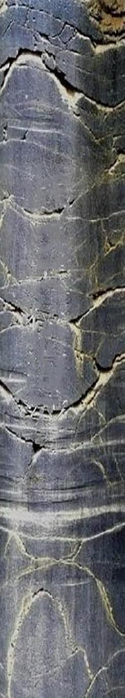
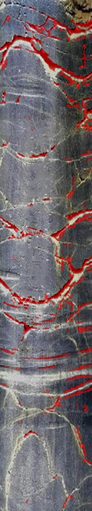
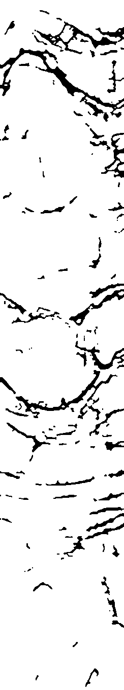
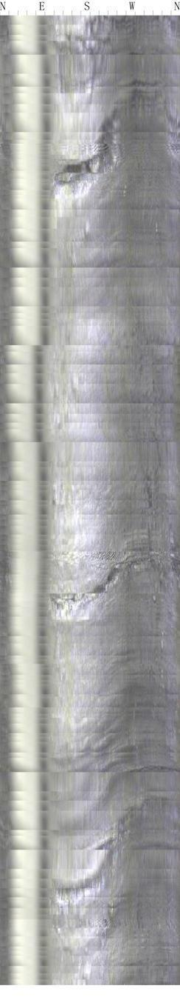

# crack-detection-algorithm

基于深度学习和计算机视觉的钻孔成像裂隙自动识别算法。

**[English Version](README_EN.md) | 中文版本**

**主要功能**

> 💡 **提示：** 点击下方功能标题可展开查看详细说明

<details>
<summary><b>1. 预处理</b></summary>

自动进行图像预处理，包括光照矫正和竖条纹抑制，提升图像质量。

**功能特点：**
- 同态/Retinex风格光照矫正
- 自适应直方图均衡（CLAHE）
- 竖条纹智能检测与抑制
- 环形边界处理

</details>

<details>
<summary><b>2. 特征增强</b></summary>

基于Sato滤波器和Canny边缘检测的裂隙特征增强算法。

**算法优势：**
- Sato黑脊线检测，专门针对黑色细线裂隙
- 多尺度特征融合 (1, 2, 3, 4 像素尺度)
- Canny边缘检测补充对比度变化
- 自适应权重组合 (75% Sato + 25% Canny)

</details>

<details>
<summary><b>3. 分割算法</b></summary>

采用Otsu自适应阈值分割，自动确定最佳分割阈值。

**技术特点：**
- 全自动阈值选择
- 适应不同图像条件
- 支持scikit-image和OpenCV双重后备

</details>

<details>
<summary><b>4. 后处理</b></summary>

多重几何特征筛选和形态学优化，大幅减少误检测。

**筛选机制：**
- 长宽比筛选 (≥2.0:1)
- 面积和长度过滤
- 竖条纹智能识别与过滤
- 形状规整性检查 (solidity < 0.99)
- 紧凑性筛选 (compactness ≥ 1.2)
- 多方向形态学连接

**⚠️ 重要特性：**
- 短竖直特征保护机制，避免误删真实裂缝
- 像素-毫米精确换算 (周长94.25mm, 孔深500mm)
- 自适应参数调整

</details>

<details>
<summary><b>5. 可视化输出</b></summary>

生成专业的二值掩膜和叠加可视化结果。

**输出格式：**
- 二值掩膜PNG: 裂隙=黑色(0), 背景=白色(255)
- 叠加可视化JPG: 红色半透明标注裂隙位置
- 支持批量处理和自动命名

</details>

**算法性能指标**

基于实际钻孔数据测试：
- **误检测控制**: 显著减少岩石纹理误识别
- **竖条纹过滤**: 有效过滤泥浆/拼接线干扰  
- **裂缝完整性**: 保持真实裂缝的连续性和细节
- **处理速度**: 单张图像(244×1350) < 2秒

## 效果展示

### 成功案例 - 复杂裂缝网络识别

以下展示系统对复杂裂缝网络的识别效果：

**原始图像 → 处理结果**

| 原始钻孔图像 | 裂缝检测结果 | 二值掩膜 |
|-------------|-------------|----------|
|  |  |  |

**处理效果分析：**
- ✅ **裂缝网络完整识别**: 成功检出主要裂缝结构和分支
- ✅ **边界精确**: 裂缝边界清晰，细节保留完整  
- ✅ **连续性良好**: 裂缝路径连贯，无明显断裂
- ✅ **误检测控制**: 岩石纹理干扰得到有效抑制

### 算法改进空间与协作邀请

尽管系统已能处理大多数场景，但仍存在优化空间。以下展示一个挑战性案例：

**挑战案例分析**

| 原始图像 | 当前检测结果 |
|---------|-------------|
|  |  |

**存在的问题：**
- 🔸 **部分过检测**: 某些岩石纹理仍被误识别为裂缝
- 🔸 **细微裂缝遗漏**: 极细的裂缝可能被过滤
- 🔸 **边界模糊处理**: 对比度较低的边界识别有待提升

**🤝 寻求合作与改进**

我们诚邀研究者和开发者共同改进算法：

- **深度学习方法**: 基于CNN/Transformer的端到端检测
- **多尺度融合**: 更精细的特征金字塔网络
- **域适应技术**: 适应不同地质条件和成像设备
- **后处理优化**: 更智能的几何特征筛选策略
- **标注数据集**: 构建高质量的裂缝检测基准数据集

**📧 联系方式**: 
- 欢迎通过 GitHub Issues 讨论技术方案
- 可提交 Pull Request 贡献代码改进
- 学术合作请通过邮件联系

> 💡 **参与贡献**: 无论是算法改进、bug修复还是文档完善，我们都非常欢迎您的参与！

## 1. 快速开始

### 1.1. 环境要求

<details>
<summary>依赖安装详情</summary>

**Python环境：**
- Python 3.8+ (推荐 3.9+)
- 支持Windows, macOS, Linux

**核心依赖：**
```bash
pip install numpy opencv-python scikit-image scipy
```

**可选依赖（增强功能）：**
```bash
pip install matplotlib  # 调试可视化
```

</details>

### 1.2. 安装使用

**方式一：直接运行**
```bash
# 克隆或下载项目
git clone <your-repo-url>
cd crack_detection_system

# 安装依赖
pip install numpy opencv-python scikit-image scipy

# 运行检测
python main.py --input_dir data --output_dir results
```

**方式二：作为模块导入**
```python
from utils import imread_gray, estimate_px_per_mm
from preprocessing import preprocess_image
from enhancement import enhance_cracks
from segmentation import segment_and_postprocess
from visualization import make_visual_overlay

# 检测单张图像
bgr, gray = imread_gray("image.jpg")
# ... 处理流程
```

### 1.3. 参数配置

```bash
python main.py \
  --input_dir data \          # 输入目录
  --output_dir results \      # 输出目录  
  --circum_mm 94.25 \        # 钻孔周长(mm)
  --depth_mm 500.0           # 孔深(mm)
```

## 1.4. 验证结果

运行成功后检查输出目录：

```
results/
├── image_1_mask.png      # 二值掩膜
├── image_1_overlay.jpg   # 可视化结果
├── image_2_mask.png
└── image_2_overlay.jpg
```

## 2. 系统架构

本系统采用模块化设计，便于维护和扩展。

### 2.1. 核心模块

<details>
<summary><b>utils.py - 工具函数模块</b></summary>

**主要功能：**
- 文件IO操作和目录管理
- 图像读取和格式转换
- 数据归一化处理
- 像素-毫米精确换算

**核心函数：**
```python
def imread_gray(path)                    # 图像读取
def normalize01(x)                       # 数据归一化  
def estimate_px_per_mm(w, h, c_mm, d_mm) # 换算比例计算
```

</details>

<details>
<summary><b>preprocessing.py - 预处理模块</b></summary>

**主要功能：**
- 光照不均匀矫正
- 竖条纹智能抑制
- 图像质量增强

**核心算法：**
```python
def illumination_correction(gray)        # 光照矫正
def suppress_vertical_stripes(gray)      # 竖条纹抑制
def preprocess_image(gray_img)          # 完整预处理流程
```

</details>

<details>
<summary><b>enhancement.py - 特征增强模块</b></summary>

**主要功能：**
- Sato黑脊线检测
- Canny边缘检测
- 多特征融合算法

**算法参数：**
- Sato尺度: (1, 2, 3, 4) 像素
- 权重分配: 75% Sato + 25% Canny
- Canny阈值: low=0.1, high=0.3

</details>

<details>
<summary><b>segmentation.py - 分割后处理模块</b></summary>

**主要功能：**
- Otsu自适应阈值分割
- 多重几何特征筛选
- 形态学优化处理

**筛选条件：**
- 最小长度: 5mm (可配置)
- 宽度阈值: 1.0mm (可配置) 
- 长宽比: ≥2.0:1
- 形状规整性: solidity < 0.99
- 紧凑性: compactness ≥ 1.2

</details>

<details>
<summary><b>visualization.py - 可视化模块</b></summary>

**主要功能：**
- 结果叠加可视化
- 多格式文件保存
- 颜色和透明度配置

**输出规格：**
- 掩膜格式: PNG, 8位灰度
- 叠加格式: JPG, 24位彩色
- 默认颜色: 红色 (0,0,255)
- 透明度: 60%

</details>

<details>
<summary><b>config.py - 配置管理模块</b></summary>

**配置分类：**
```python
# 钻孔几何参数
BOREHOLE_CONFIG = {
    'circumference_mm': 94.25,
    'depth_mm': 500.0
}

# 算法参数
ENHANCEMENT_CONFIG = {
    'sato_sigmas': (1, 2, 3, 4),
    'sato_weight': 0.75,
    'canny_weight': 0.25
}

# 后处理参数  
POSTPROCESSING_CONFIG = {
    'min_length_mm': 5.0,
    'width_mm_threshold': 1.0,
    'aspect_ratio_threshold': 2.0
}
```

</details>

### 2.2. 使用示例

<details>
<summary><b>批量处理</b></summary>

```bash
# 基本用法
python main.py --input_dir ./images --output_dir ./results

# 自定义参数
python main.py \
  --input_dir /path/to/images \
  --output_dir /path/to/results \
  --circum_mm 100.0 \
  --depth_mm 600.0
```

**输出统计：**
```
找到 4 张图片，开始处理...
输出目录: results
钻孔参数: 周长=94.25mm, 孔深=500.0mm
------------------------------------------------------------
处理图片 1/4: image1.jpg
尺寸: 244x1350, 像素/毫米: X=2.59, Y=2.70
结果已保存: results/image1_mask.png, results/image1_overlay.jpg
------------------------------------------------------------
处理完成! 成功: 4/4
```

</details>

<details>
<summary><b>模块化调用</b></summary>

```python
# example_usage.py 完整示例
from utils import imread_gray, estimate_px_per_mm
from preprocessing import preprocess_image
from enhancement import enhance_cracks
from segmentation import segment_and_postprocess
from visualization import make_visual_overlay

def detect_cracks_in_image(image_path):
    # 1. 读取图像
    bgr_img, gray_img = imread_gray(image_path)
    h, w = gray_img.shape
    
    # 2. 计算换算比例
    _, _, px_per_mm = estimate_px_per_mm(w, h, 94.25, 500.0)
    
    # 3. 完整处理流程
    preprocessed = preprocess_image(gray_img)
    prob_map = enhance_cracks(preprocessed)  
    crack_mask = segment_and_postprocess(prob_map, px_per_mm)
    overlay = make_visual_overlay(bgr_img, crack_mask)
    
    return bgr_img, crack_mask, overlay

# 使用示例
original, mask, result = detect_cracks_in_image("test.jpg")
print(f"检测到的裂缝像素数: {np.sum(mask)}")
```

</details>

<details>
<summary><b>参数自定义</b></summary>

修改 `config.py` 实现个性化配置：

```python
# 调整算法敏感度
ENHANCEMENT_CONFIG = {
    'sato_weight': 0.8,    # 提高Sato权重
    'canny_weight': 0.2,   # 降低Canny权重
}

# 调整筛选严格度  
POSTPROCESSING_CONFIG = {
    'min_length_mm': 3.0,           # 降低长度要求
    'aspect_ratio_threshold': 1.5,  # 放宽长宽比
    'compactness_threshold': 1.0,   # 放宽紧凑性
}
```

</details>

## 3. 技术原理

### 3.1. 算法流程

```
原始图像
    ↓
预处理 (光照矫正 + 竖条纹抑制)
    ↓  
特征增强 (Sato滤波 + Canny边缘)
    ↓
自适应分割 (Otsu阈值)
    ↓
后处理筛选 (几何特征 + 形态学)
    ↓
结果输出 (二值掩膜 + 可视化)
```

### 3.2. 核心创新点

- **多尺度Sato滤波**: 针对不同宽度裂缝的检测优化
- **智能竖条纹过滤**: 多重条件判断，避免误删真实裂缝  
- **几何特征综合筛选**: 长宽比、紧凑性、规整性多重验证
- **像素精度换算**: 基于实际钻孔参数的精确测量

### 3.3. 性能优化

- **梯度回退机制**: scikit-image → OpenCV → 基础算法
- **模块化设计**: 便于算法组件替换和升级
- **批处理优化**: 支持大批量图像高效处理

## 4. 开发和贡献

### 4.1. 开发环境搭建

```bash
# 1. 克隆项目
git clone <repo-url>
cd crack_detection_system

# 2. 创建虚拟环境
python -m venv venv
source venv/bin/activate  # Linux/Mac
# 或 venv\Scripts\activate  # Windows

# 3. 安装开发依赖
pip install -r requirements-dev.txt

# 4. 运行测试
python -m pytest tests/
```

### 4.2. 项目结构

```
crack_detection_system/
├── main.py              # 主程序入口
├── config.py            # 配置管理
├── utils.py             # 工具函数
├── preprocessing.py     # 预处理模块
├── enhancement.py       # 特征增强
├── segmentation.py      # 分割后处理  
├── visualization.py     # 可视化输出
├── example_usage.py     # 使用示例
├── README.md           # 项目文档
├── data/               # 测试数据
└── results/            # 输出结果
```

### 4.3. 贡献指南

欢迎提交Issue和Pull Request！

**贡献方向：**
- 算法优化和新特征
- 性能提升和bug修复  
- 文档改进和示例添加
- 测试用例和基准数据

## 🙏 致谢

感谢所有为钻孔图像处理技术发展做出贡献的研究者和开发者！

**技术支持：**
- scikit-image 社区的优秀图像处理算法
- OpenCV 团队的计算机视觉基础库支持
- SciPy 生态系统的数值计算能力

---

**版本信息:** v2.0 (模块化重构版)  
**更新时间:** 2025年  
**开源协议:** MIT License