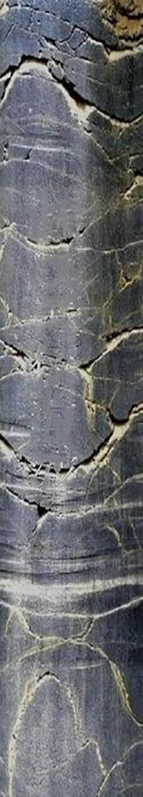
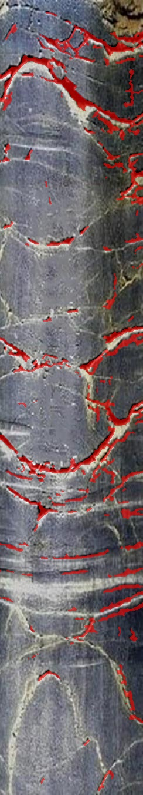
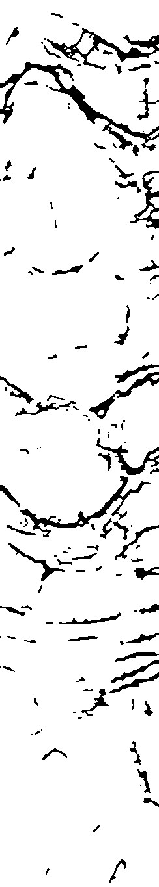
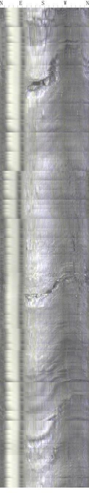
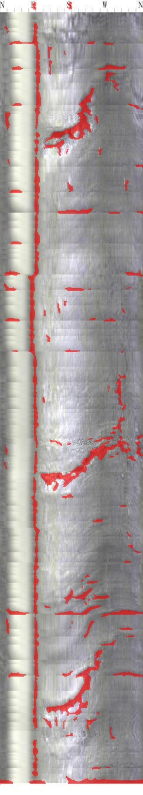

# crack-detection-algorithm

An automated crack detection algorithm for borehole imaging based on deep learning and computer vision.

**English Version | [中文版本](README.md)**

**Key Features**

> 💡 **Tip:** Click the feature titles below to expand detailed descriptions

<details>
<summary><b>1. Intelligent Preprocessing</b></summary>

Automatic image preprocessing including illumination correction and vertical stripe suppression to enhance image quality.

**Features:**
- Homomorphic/Retinex-style illumination correction
- Adaptive Histogram Equalization (CLAHE)
- Intelligent vertical stripe detection and suppression
- Circular boundary handling

</details>

<details>
<summary><b>2. Precise Feature Enhancement</b></summary>

Crack feature enhancement algorithm based on Sato filter and Canny edge detection.

**Algorithm Advantages:**
- Sato black ridge detection, specifically designed for dark linear cracks
- Multi-scale feature fusion (1, 2, 3, 4 pixel scales)
- Canny edge detection for contrast change enhancement
- Adaptive weight combination (75% Sato + 25% Canny)

</details>

<details>
<summary><b>3. Intelligent Segmentation</b></summary>

Otsu adaptive threshold segmentation for automatic optimal threshold determination.

**Technical Features:**
- Fully automatic threshold selection
- Adaptation to different image conditions
- Dual fallback support for scikit-image and OpenCV

</details>

<details>
<summary><b>4. Advanced Post-processing</b></summary>

Multiple geometric feature filtering and morphological optimization to significantly reduce false detections.

**Filtering Mechanisms:**
- Aspect ratio filtering (≥2.0:1)
- Area and length filtering
- Intelligent vertical stripe identification and filtering
- Shape regularity check (solidity < 0.99)
- Compactness filtering (compactness ≥ 1.2)
- Multi-directional morphological connection

**⚠️ Key Features:**
- Short vertical feature protection mechanism to avoid deleting real cracks
- Pixel-to-millimeter precise conversion (circumference 94.25mm, depth 500mm)
- Adaptive parameter adjustment

</details>

<details>
<summary><b>5. Visualization Output</b></summary>

Generate professional binary masks and overlay visualization results.

**Output Formats:**
- Binary mask PNG: Cracks=Black(0), Background=White(255)
- Overlay visualization JPG: Red semi-transparent crack annotations
- Support for batch processing and automatic naming

</details>

**Algorithm Performance Metrics**

Based on real borehole data testing:
- **False Detection Control**: Significantly reduces rock texture misidentification
- **Vertical Stripe Filtering**: Effectively filters mud/seam line interference
- **Crack Integrity**: Maintains continuity and details of real cracks
- **Processing Speed**: Single image (244×1350) < 2 seconds

## Results Demonstration

### Success Case - Complex Crack Network Recognition

The following demonstrates the system's performance on complex crack networks:

**Original Image → Processing Results**

| Original Borehole Image | Crack Detection Result | Binary Mask |
|------------------------|----------------------|-------------|
|  |  |  |

**Performance Analysis:**
- ✅ **Complete Crack Network Recognition**: Successfully detects main crack structures and branches
- ✅ **Precise Boundaries**: Clear crack boundaries with complete detail preservation
- ✅ **Good Continuity**: Coherent crack paths without obvious breaks
- ✅ **False Detection Control**: Effective suppression of rock texture interference

### Algorithm Improvement Opportunities & Collaboration Invitation

Although the system can handle most scenarios, there is still room for optimization. The following shows a challenging case:

**Challenge Case Analysis**

| Original Image | Current Detection Result |
|---------------|------------------------|
|  |  |

**Existing Issues:**
- 🔸 **Partial Over-detection**: Some rock textures are still misidentified as cracks
- 🔸 **Fine Crack Omission**: Extremely fine cracks may be filtered out
- 🔸 **Blurred Boundary Processing**: Recognition of low-contrast boundaries needs improvement

**🤝 Seeking Collaboration and Improvement**

We invite researchers and developers to jointly improve the algorithm:

- **Deep Learning Methods**: End-to-end detection based on CNN/Transformer
- **Multi-scale Fusion**: More refined feature pyramid networks
- **Domain Adaptation**: Adaptation to different geological conditions and imaging devices
- **Post-processing Optimization**: More intelligent geometric feature filtering strategies
- **Annotated Datasets**: Building high-quality crack detection benchmark datasets

**📧 Contact Information**: 
- Welcome to discuss technical solutions through GitHub Issues
- Submit Pull Requests for code improvements
- Contact via email for academic collaboration

> 💡 **Contribute**: Whether it's algorithm improvement, bug fixes, or documentation enhancement, we welcome your participation!

## 1. Quick Start

### 1.1. Environment Requirements

<details>
<summary>Dependency Installation Details</summary>

**Python Environment:**
- Python 3.8+ (recommended 3.9+)
- Support for Windows, macOS, Linux

**Core Dependencies:**
```bash
pip install numpy opencv-python scikit-image scipy
```

**Optional Dependencies (Enhanced Features):**
```bash
pip install matplotlib  # Debug visualization
```

</details>

### 1.2. Installation and Usage

**Method 1: Direct Execution**
```bash
# Clone or download the project
git clone <your-repo-url>
cd crack_detection_system

# Install dependencies
pip install numpy opencv-python scikit-image scipy

# Run detection
python main.py --input_dir data --output_dir results
```

**Method 2: Import as Module**
```python
from utils import imread_gray, estimate_px_per_mm
from preprocessing import preprocess_image
from enhancement import enhance_cracks
from segmentation import segment_and_postprocess
from visualization import make_visual_overlay

# Detect single image
bgr, gray = imread_gray("image.jpg")
# ... processing pipeline
```

### 1.3. Parameter Configuration

```bash
python main.py \
  --input_dir data \          # Input directory
  --output_dir results \      # Output directory  
  --circum_mm 94.25 \        # Borehole circumference (mm)
  --depth_mm 500.0           # Depth (mm)
```

## 1.4. Result Verification

After successful execution, check the output directory:

```
results/
├── image_1_mask.png      # Binary mask
├── image_1_overlay.jpg   # Visualization result
├── image_2_mask.png
└── image_2_overlay.jpg
```

## 2. System Architecture

The system adopts a modular design for easy maintenance and extension.

### 2.1. Core Modules

<details>
<summary><b>utils.py - Utility Functions Module</b></summary>

**Main Functions:**
- File I/O operations and directory management
- Image reading and format conversion
- Data normalization processing
- Pixel-to-millimeter precise conversion

**Core Functions:**
```python
def imread_gray(path)                    # Image reading
def normalize01(x)                       # Data normalization  
def estimate_px_per_mm(w, h, c_mm, d_mm) # Conversion ratio calculation
```

</details>

<details>
<summary><b>preprocessing.py - Preprocessing Module</b></summary>

**Main Functions:**
- Uneven illumination correction
- Intelligent vertical stripe suppression
- Image quality enhancement

**Core Algorithms:**
```python
def illumination_correction(gray)        # Illumination correction
def suppress_vertical_stripes(gray)      # Vertical stripe suppression
def preprocess_image(gray_img)          # Complete preprocessing pipeline
```

</details>

<details>
<summary><b>enhancement.py - Feature Enhancement Module</b></summary>

**Main Functions:**
- Sato black ridge detection
- Canny edge detection
- Multi-feature fusion algorithm

**Algorithm Parameters:**
- Sato scales: (1, 2, 3, 4) pixels
- Weight distribution: 75% Sato + 25% Canny
- Canny thresholds: low=0.1, high=0.3

</details>

<details>
<summary><b>segmentation.py - Segmentation and Post-processing Module</b></summary>

**Main Functions:**
- Otsu adaptive threshold segmentation
- Multiple geometric feature filtering
- Morphological optimization processing

**Filtering Conditions:**
- Minimum length: 5mm (configurable)
- Width threshold: 1.0mm (configurable) 
- Aspect ratio: ≥2.0:1
- Shape regularity: solidity < 0.99
- Compactness: compactness ≥ 1.2

</details>

<details>
<summary><b>visualization.py - Visualization Module</b></summary>

**Main Functions:**
- Result overlay visualization
- Multi-format file saving
- Color and transparency configuration

**Output Specifications:**
- Mask format: PNG, 8-bit grayscale
- Overlay format: JPG, 24-bit color
- Default color: Red (0,0,255)
- Transparency: 60%

</details>

<details>
<summary><b>config.py - Configuration Management Module</b></summary>

**Configuration Categories:**
```python
# Borehole geometric parameters
BOREHOLE_CONFIG = {
    'circumference_mm': 94.25,
    'depth_mm': 500.0
}

# Algorithm parameters
ENHANCEMENT_CONFIG = {
    'sato_sigmas': (1, 2, 3, 4),
    'sato_weight': 0.75,
    'canny_weight': 0.25
}

# Post-processing parameters  
POSTPROCESSING_CONFIG = {
    'min_length_mm': 5.0,
    'width_mm_threshold': 1.0,
    'aspect_ratio_threshold': 2.0
}
```

</details>

### 2.2. Usage Examples

<details>
<summary><b>Batch Processing</b></summary>

```bash
# Basic usage
python main.py --input_dir ./images --output_dir ./results

# Custom parameters
python main.py \
  --input_dir /path/to/images \
  --output_dir /path/to/results \
  --circum_mm 100.0 \
  --depth_mm 600.0
```

**Output Statistics:**
```
Found 4 images, starting processing...
Output directory: results
Borehole parameters: circumference=94.25mm, depth=500.0mm
------------------------------------------------------------
Processing image 1/4: image1.jpg
Dimensions: 244x1350, pixels/mm: X=2.59, Y=2.70
Results saved: results/image1_mask.png, results/image1_overlay.jpg
------------------------------------------------------------
Processing completed! Success: 4/4
```

</details>

<details>
<summary><b>Modular Invocation</b></summary>

```python
# example_usage.py complete example
from utils import imread_gray, estimate_px_per_mm
from preprocessing import preprocess_image
from enhancement import enhance_cracks
from segmentation import segment_and_postprocess
from visualization import make_visual_overlay

def detect_cracks_in_image(image_path):
    # 1. Read image
    bgr_img, gray_img = imread_gray(image_path)
    h, w = gray_img.shape
    
    # 2. Calculate conversion ratio
    _, _, px_per_mm = estimate_px_per_mm(w, h, 94.25, 500.0)
    
    # 3. Complete processing pipeline
    preprocessed = preprocess_image(gray_img)
    prob_map = enhance_cracks(preprocessed)  
    crack_mask = segment_and_postprocess(prob_map, px_per_mm)
    overlay = make_visual_overlay(bgr_img, crack_mask)
    
    return bgr_img, crack_mask, overlay

# Usage example
original, mask, result = detect_cracks_in_image("test.jpg")
print(f"Detected crack pixels: {np.sum(mask)}")
```

</details>

<details>
<summary><b>Parameter Customization</b></summary>

Modify `config.py` for personalized configuration:

```python
# Adjust algorithm sensitivity
ENHANCEMENT_CONFIG = {
    'sato_weight': 0.8,    # Increase Sato weight
    'canny_weight': 0.2,   # Decrease Canny weight
}

# Adjust filtering strictness  
POSTPROCESSING_CONFIG = {
    'min_length_mm': 3.0,           # Lower length requirement
    'aspect_ratio_threshold': 1.5,  # Relax aspect ratio
    'compactness_threshold': 1.0,   # Relax compactness
}
```

</details>

## 3. Technical Principles

### 3.1. Algorithm Pipeline

```
Original Image
    ↓
Preprocessing (Illumination correction + Vertical stripe suppression)
    ↓  
Feature Enhancement (Sato filtering + Canny edges)
    ↓
Adaptive Segmentation (Otsu threshold)
    ↓
Post-processing Filtering (Geometric features + Morphology)
    ↓
Result Output (Binary mask + Visualization)
```

### 3.2. Core Innovations

- **Multi-scale Sato Filtering**: Detection optimization for different crack widths
- **Intelligent Vertical Stripe Filtering**: Multi-condition judgment to avoid deleting real cracks
- **Comprehensive Geometric Feature Filtering**: Multi-verification of aspect ratio, compactness, regularity
- **Pixel-precision Conversion**: Precise measurement based on actual borehole parameters

### 3.3. Performance Optimization

- **Gradient Fallback Mechanism**: scikit-image → OpenCV → Basic algorithms
- **Modular Design**: Easy algorithm component replacement and upgrades
- **Batch Processing Optimization**: Support for efficient processing of large batches of images

## 4. Development and Contribution

### 4.1. Development Environment Setup

```bash
# 1. Clone project
git clone <repo-url>
cd crack_detection_system

# 2. Create virtual environment
python -m venv venv
source venv/bin/activate  # Linux/Mac
# or venv\Scripts\activate  # Windows

# 3. Install development dependencies
pip install -r requirements-dev.txt

# 4. Run tests
python -m pytest tests/
```

### 4.2. Project Structure

```
crack_detection_system/
├── main.py              # Main program entry
├── config.py            # Configuration management
├── utils.py             # Utility functions
├── preprocessing.py     # Preprocessing module
├── enhancement.py       # Feature enhancement
├── segmentation.py      # Segmentation post-processing  
├── visualization.py     # Visualization output
├── example_usage.py     # Usage examples
├── README.md           # Project documentation
├── data/               # Test data
└── results/            # Output results
```

### 4.3. Contribution Guidelines

Welcome to submit Issues and Pull Requests!

**Contribution Directions:**
- Algorithm optimization and new features
- Performance improvements and bug fixes
- Documentation improvements and example additions
- Test cases and benchmark data

## 🙏 Acknowledgments

Thanks to all researchers and developers who have contributed to the development of borehole image processing technology!

**Technical Support:**
- Excellent image processing algorithms from the scikit-image community
- Computer vision foundational library support from the OpenCV team
- Numerical computing capabilities of the SciPy ecosystem

---

**Version Information:** v2.0 (Modular Refactoring Version)  
**Update Time:** 2025  
**Open Source License:** MIT License